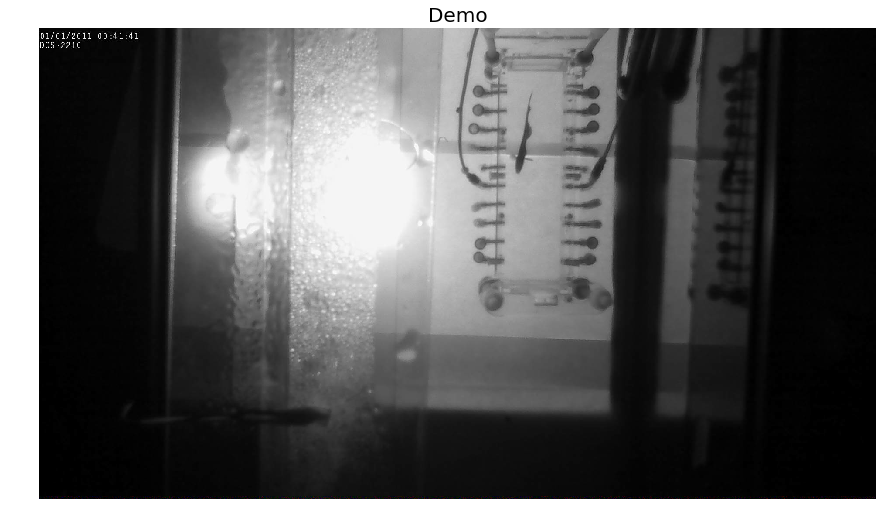
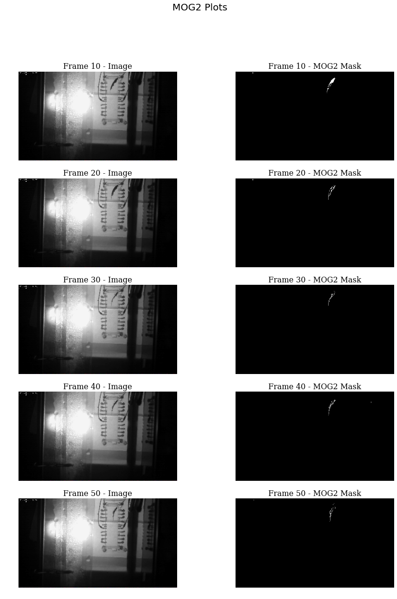
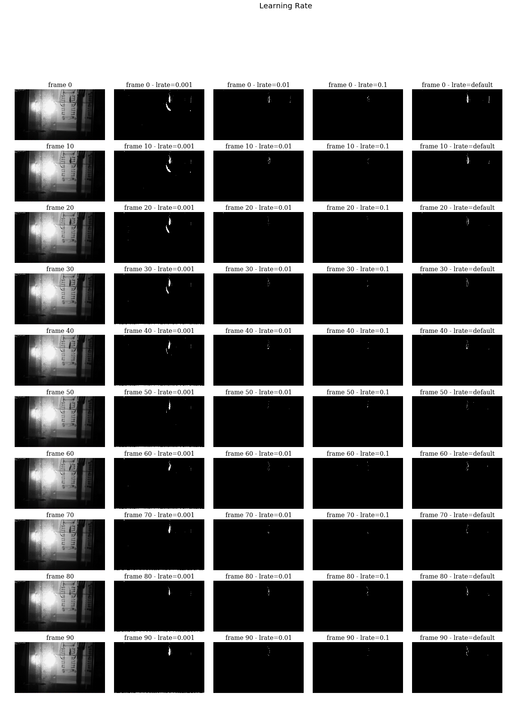
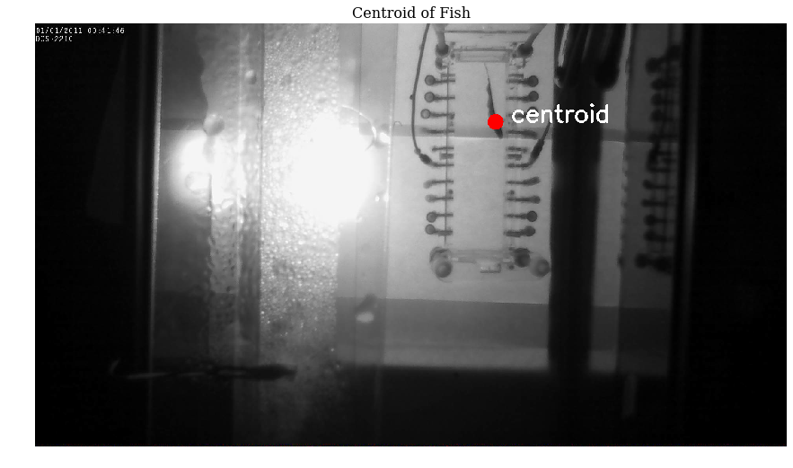
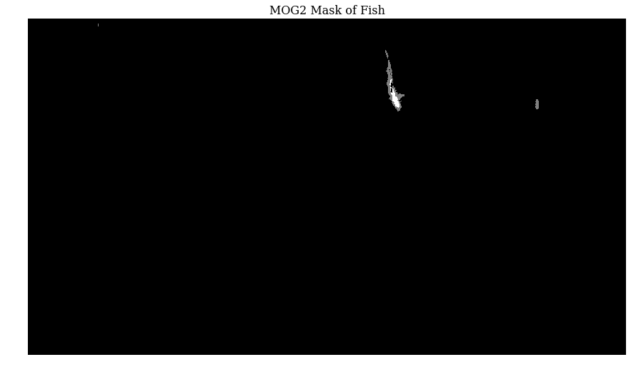
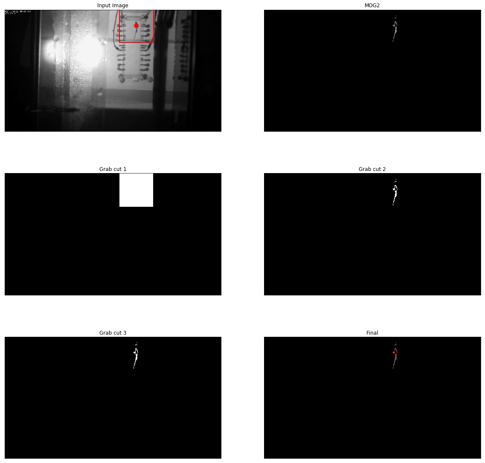

# Foreground Segmentation and Centroid with MOG2
author: Andre Telfer    
email:  telfer006@gmail.com    
date:   2018-10-06    

## Description
This notebook was created to demonstrate foreground extraction from video. The video was taken from lab footage provided by uOttawa.

## Topics
- Image segmentation
- Image co-segmentation
- Foreground-background segmentation
- Object extraction
- Background extraction
- Foreground extraction


## Setup


```python
import cv2              
import os

# load video
video_file = os.path.join(os.getcwd(), '../video_fish_A.avi')
cap = cv2.VideoCapture(video_file)
assert cap.isOpened(), "Error opening video file"

# get properties
frames = cap.get(cv2.CAP_PROP_FRAME_COUNT)
```

## Load Single Frame
Demonstrate loading a single frame


```python
%matplotlib inline
import matplotlib.pyplot as plt

ret, frame = cap.read()
plt.figure(figsize=(15,10))
plt.axis('off')
plt.title('Demo', fontsize=20)
plt.imshow(frame)
```


    <matplotlib.image.AxesImage at 0x7fabdf64b518>





## Background Subtraction using MOG2
Following the OpenCV [Background Subtraction Tutorial](https://docs.opencv.org/3.0-beta/doc/py_tutorials/py_video/py_bg_subtraction/py_bg_subtraction.html)

MOG2 creates adaptive Gaussian Mixture Models (GMMs) in order to subtract the background from real-time video feed

Two disadvantages of this method are
- MOG2 is adaptive, if the fish does not move then soon parts of it won't extracted
- MOG2 does not care what changes. When the fish moves, the area it left behind will have changed as well as the area it moves to. This will cause the centre of the data points to be dragged back


```python
import numpy as np
import cv2

# setup the graph space
font = {
    'family': 'serif',
    'color':  'black',
    'weight': 'normal',
    'size': 16,
}
fig = plt.figure(figsize=(15,20))
fig.suptitle("MOG2 Plots", fontsize=20)

# initialize the background subtractor
kernel = cv2.getStructuringElement(cv2.MORPH_ELLIPSE,(3,3))
fgbg = cv2.createBackgroundSubtractorMOG2()

# train the MOG2
for _ in range(100):
    # load frame
    ret, frame = cap.read()
    
    # update the background subtractor
    fgmask = fgbg.apply(frame)
    fgmask = cv2.morphologyEx(fgmask, cv2.MORPH_OPEN, kernel)
    
# display every 10th frame
for i in range(60):
    # load frame
    ret, frame = cap.read()
    
    # update the background subtractor
    fgmask = fgbg.apply(frame)
    fgmask = cv2.morphologyEx(fgmask, cv2.MORPH_OPEN, kernel)
    
    # display every 10th frame, skip the first
    if i != 0 and i % 10 == 0:
        # plot MOG2
        rows = int(100 / 10 / 2) 
        cols = 2 
        index = 2*int(i / 10) - 1     
        plt.subplot(rows, cols, index)
        plt.imshow(frame, 'gray')
        plt.title('Frame {} - Image'.format(i), font)
        plt.axis('off')
        
        # plot MOG2 without shadow
        index = 2*int(i / 10)  
        plt.subplot(rows, cols, index)
        plt.imshow(fgmask, 'gray')
        plt.title('Frame {} - MOG2 Mask'.format(i), font)
        plt.axis('off')
```





## Comparing Learning Rates
The learning rate in MOG2 determines how quickly it adjusts to past frames. In this case, parts of the fish do not move may be learnt. To avoid this, we can try setting the learning rate lower

We note here that the default learning rate appears to do the best job at isolating the fish


```python
import numpy as np
import cv2

# setup the graph space
font = {
    'family': 'serif',
    'color':  'black',
    'weight': 'normal',
    'size': 16,
}
fig = plt.figure(figsize=(20,30))
fig.suptitle("Learning Rate", fontsize=20)
fig.subplots_adjust(wspace=0.1, hspace=0, left=0)

# initialize the background subtractor
models = [
    {
        'learning_rate': 0.001,
        'model': cv2.createBackgroundSubtractorMOG2()
    },
    {
        'learning_rate': 0.01,
        'model': cv2.createBackgroundSubtractorMOG2()
    },
    {
        'learning_rate': 0.1,
        'model': cv2.createBackgroundSubtractorMOG2()
    },
    {
        'learning_rate': -1,
        'model': cv2.createBackgroundSubtractorMOG2()
    },
]

kernel = cv2.getStructuringElement(cv2.MORPH_ELLIPSE,(3,3))

for _ in range(100):
    # load frame
    ret, frame = cap.read()
    
    # update the background subtractor
    for model in models:
        fgbg = model['model']
        if model['learning_rate'] != -1:
            fgmask = fgbg.apply(frame, learningRate=model['learning_rate'])
        else:
            fgmask = fgbg.apply(frame)
        fgmask = cv2.morphologyEx(fgmask, cv2.MORPH_OPEN, kernel)
    
# main process
rows = 10
cols = len(models) + 1
index = 1
for i in range(10*rows):
    # load frame
    ret, frame = cap.read()
    if i % 10 == 0:
        plt.subplot(rows, cols, index)
        plt.imshow(frame)
        plt.title('frame {}'.format(i), font)
        plt.axis('off')
        index+=1
        
    # update the background subtractor
    for model in models:
        fgbg = model['model']
        if model['learning_rate'] != -1:
            fgmask = fgbg.apply(frame, learningRate=model['learning_rate'])
        else:
            fgmask = fgbg.apply(frame)
        fgmask = cv2.morphologyEx(fgmask, cv2.MORPH_OPEN, kernel)
        
        if i % 10 == 0:
            plt.subplot(rows, cols, index)
            plt.imshow(fgmask, 'gray')
            lrate_text =  model['learning_rate'] if  model['learning_rate'] != -1 else 'default'
            plt.title('frame {} - lrate={}'.format(i, lrate_text), font)
            plt.axis('off')
            index += 1
```





## Getting the Centre of the Fish
Following Krutika Bapat's tutorial on [finding the center of a blob](https://www.learnopencv.com/find-center-of-blob-centroid-using-opencv-cpp-python/).

This code finds the centroid by using the image moment, which is the value of the pixels modified by their intensity.

### Explanation
Image momement $ M_{ij}$ is found with:

$M_{ij} = \sum\limits_x\sum\limits_y x^i y^j I(x,y)$ 

Where $I(x,y)$ returns the intensity of a pixel at location $x$,$y$

This centroid using the image moment is 

$\large x_{center}=\frac{M_{10}}{M_{00}}$     

$\large y_{center}=\frac{M_{01}}{M_{00}}$

### Notes
- After some samples, the centroid fairly accurately targets the fish. However it moves around from the head to body


```python
# load frame and apply the background subtractor
ret, img = cap.read()
fgmask = fgbg.apply(img)
fgmask = cv2.morphologyEx(fgmask, cv2.MORPH_OPEN, kernel)

# convert the grayscale image to binary image
ret,thresh = cv2.threshold(fgmask,127,255,0)
 
# calculate moments of binary image
M = cv2.moments(thresh)

# calculate x,y coordinate of center
cX = int(M["m10"] / M["m00"])
cY = int(M["m01"] / M["m00"])
 
# put text and highlight the center
cv2.circle(img, (cX, cY), 20, (255, 0, 0), -1)
cv2.putText(img, "centroid", (cX + 40, cY),cv2.FONT_HERSHEY_SIMPLEX, 2, (255, 255, 255), 5)

# plot the image 
plt.figure(figsize=(15,10))
plt.imshow(img)
plt.title('Centroid of Fish', font)
plt.axis('off')

# plot the background subtraction mask
plt.figure(figsize=(15,10))
plt.imshow(fgmask, 'gray')
plt.axis('off')
plt.title('MOG2 Mask of Fish', font)
```


    Text(0.5, 1.0, 'MOG2 Mask of Fish')








## Grab-Cut (In Progress)
After noticing the use of the grab-cut & graph-cut algorithms to correct foreground extraction in another article [1], I decided to try it here

We make some assumptions. Without these assumptions grab-cut struggles to make any differences
- We use the MOG2 to find the centroid of the foreground. We assume this is the center of the fish, and use this to draw a bounding box with out knowledge of the size of the fish

### References
1. Krause, Jonathan, et al. "Fine-grained recognition without part annotations." Proceedings of the IEEE Conference on Computer Vision and Pattern Recognition. 2015.


```python
import cv2
import numpy as np

max_fish_size = 150

# load frame and apply the background subtractor
ret, img = cap.read()
fgmask = fgbg.apply(img)
fgmask = cv2.morphologyEx(fgmask, cv2.MORPH_OPEN, kernel)

# convert the grayscale image to binary image
ret,thresh = cv2.threshold(fgmask,127,255,0)
 
# calculate moments of binary image
M = cv2.moments(thresh)

# calculate x,y coordinate of center
cX = int(M["m10"] / M["m00"])
cY = int(M["m01"] / M["m00"])                

bgdModel = np.zeros((1,13*5),np.float64)
fgdModel = np.zeros((1,13*5),np.float64)
mask = fgmask.copy()
rect = (cX-max_fish_size,cY-max_fish_size,2*max_fish_size,2*max_fish_size)   # x, y, w, h

# this modifies mask 
cv2.grabCut(img,mask,rect,bgdModel,fgdModel,5,cv2.GC_INIT_WITH_RECT)

# create the grab-cut mask from the MOG2 mask
mask2 = mask.copy()
mask2[mask==cv2.GC_BGD] = cv2.GC_BGD
mask2[mask==cv2.GC_PR_BGD] = cv2.GC_BGD
mask2[mask==cv2.GC_PR_FGD] = cv2.GC_PR_BGD
mask2[mask==cv2.GC_FGD] = cv2.GC_PR_FGD

mask2[fgmask>20] = cv2.GC_FGD
mask2[fgmask==20] = cv2.GC_FGD

mask3 = mask2.copy()
mask3 = mask3.astype('uint8')
cv2.grabCut(img,mask3,None,bgdModel,fgdModel,20,cv2.GC_INIT_WITH_MASK)

# draw centroid
cv2.circle(img, (cX, cY), 20, (255, 0, 0), -1)

# draw bounding box
cv2.rectangle(img, (cX+max_fish_size, cY+max_fish_size), (cX-max_fish_size, cY-max_fish_size), (255, 0, 0), 5)

plt.figure(figsize=(20,20))
plt.subplot(321)
plt.imshow(img)
plt.title('Input Image'), plt.xticks([]), plt.yticks([])

plt.subplot(322)
plt.imshow(fgmask, 'gray')
plt.title('MOG2'), plt.xticks([]), plt.yticks([])

plt.subplot(323)
plt.imshow(mask, 'gray')
plt.title('Grab cut 1'), plt.xticks([]), plt.yticks([])

plt.subplot(324)
plt.imshow(mask2, 'gray')
plt.title('Grab cut 2'), plt.xticks([]), plt.yticks([])

plt.subplot(325)
plt.imshow(mask3, 'gray')
plt.title('Grab cut 3'), plt.xticks([]), plt.yticks([])

# If mask==2 or mask== 1, mask2 get 0, other wise it gets 1 as 'uint8' type.
mask3 = np.where((mask3==2)|(mask3==0),0,1).astype('uint8')

# adding additional dimension for rgb to the mask, by default it gets 1
# multiply it with input image to get the segmented image
img_cut = img*mask3[:,:,np.newaxis]

plt.subplot(326),plt.imshow(img_cut)
plt.title('Final'), plt.xticks([]), plt.yticks([])
plt.show()
```





## MOG3 Proposal
A new implementation of MOG. With the following properties
- It does not learn from foreground cells
- It uses a kalman filter to make areas more sensitive to variations


Recursive update equations from [2] are updated to include $F_g(x,y)$ which is a boolean function that is 1 for background elements or 0 for foreground elements        
$\begin{align} \\
\hat\pi_m &\leftarrow \hat\pi_m + \alpha(o^t_m - \hat\pi_m) * F_g(x,y)\\
\hat\mu_m &\leftarrow \hat\mu_m + o^t(\alpha\hat\pi_m)\vec\sigma * F_g(x,y)\\
\hat\sigma_m^2 &\leftarrow \hat\sigma_m^2 + o^t(\alpha\hat\pi_m)(\vec\sigma) * F_g(x,y)\\
\end{align}$

### References
1. Zoran Zivkovic and Ferdinand van der Heijden. Efficient adaptive density estimation per image pixel for the task of background subtraction. Pattern recognition letters, 27(7):773–780, 2006.
2. Titterington, D. M. (1984). Recursive parameter estimation using incomplete data. Journal of the Royal Statistical Society. Series B (Methodological), 257-267.
